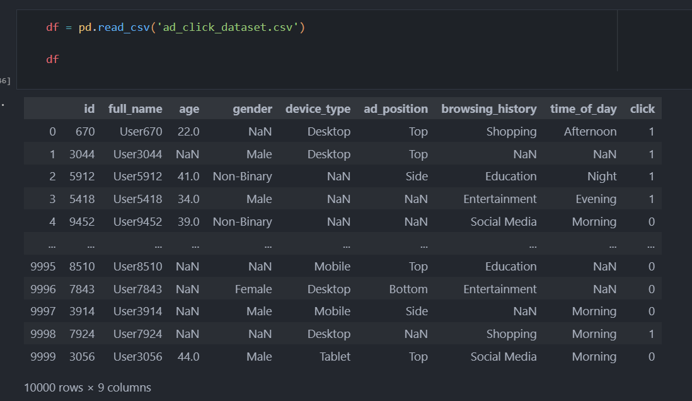
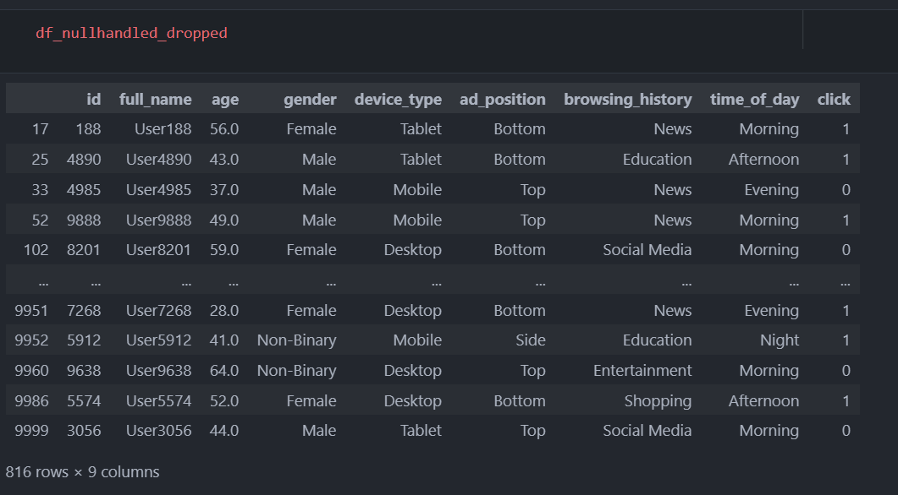
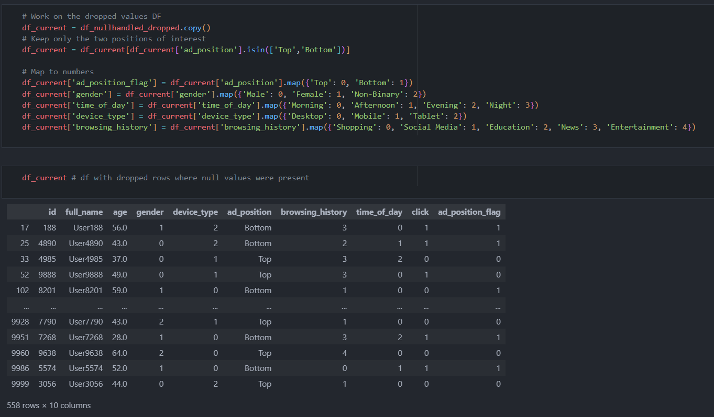
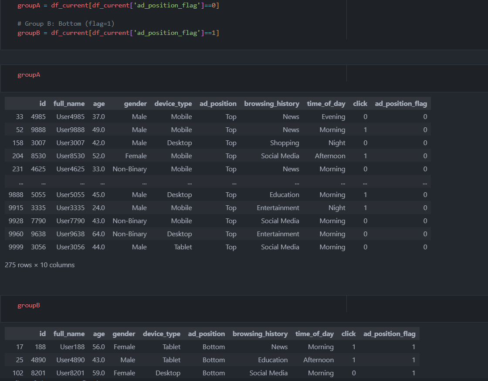
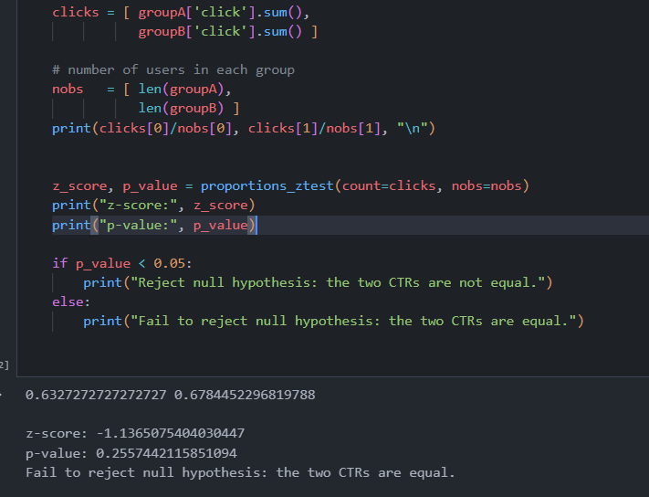
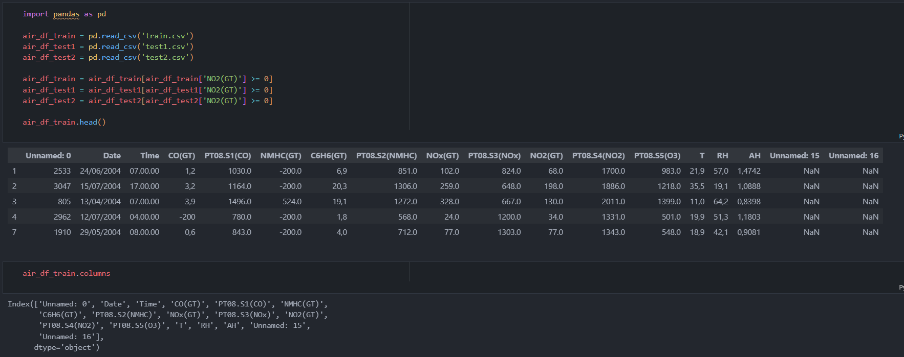
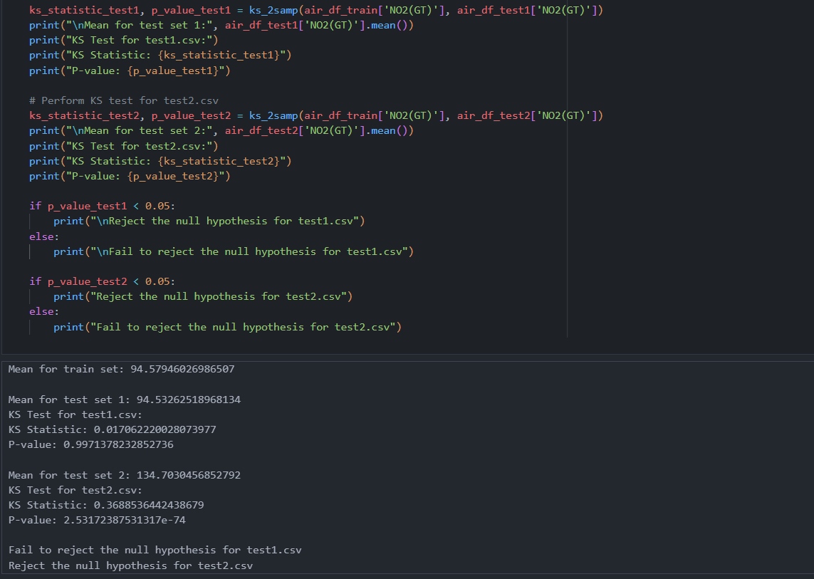

# STTAI - Lab Assignment 10

Name | Roll Number
---|---
Romit Mohane | 23110279
Rudra Pratap Singh | 23110281

Using real-world data, this assignment will introduces us to key concepts in A/B testing and Covariate Shift Detection. We performed hypothesis testing using the scipy library and identified distributional shifts in datasets using classification-based techniques.

## Part 1: A/B Testing using Ad Click Prediction
1. __Load the Dataset into a pandas df__
        
1. __Perform necessary data cleaning and preprocessing:__
    
    
1. __Split the dataset__
    
1. __Use the statsmodel’s proportions_ztest function to perform an independent two-sample z-test between Group A and Group B.__
    
1. __Interpret the result: Is there a statistically significant difference in click-through rates between the two groups? Justify your answer.__
    In our A/B test on 10,000 users (with missing values dropped), we compared click-through rates (CTRs) for ads shown at the Top vs. Bottom positions. Using a two-sample z-test, we obtained `z = -1.137` and `p = 0.256` (> 0.05), so we accept H₀ that the two CTRs are equal. The negative z-score indicates Bottom-positioned ads achieved a lower CTR than Top-positioned ads.

    **But, this difference is statistically insignificant.**

---
## Part 2: Covariate Shift Detection Using Air Quality Data
1. __Load the datasets__
    
1. __For each test dataset (test1.csv and test2.csv), compare it with train.csv using the Kolmogorov–Smirnov test (scipy.stats.ks_2samp). Perform the KS test on the NO2(GT) column to identify whether there are any distributional differences__
    
Therefore, there is a distributional difference in the values of `NO2(GT)` between the test sets.
1. __Determine which of the two test datasets (test1.csv or test2.csv) exhibits a covariate shift relative to the training dataset (train.csv). Use the results of the Kolmogorov–Smirnov test to support your answer.__
The 2nd test set exhibits a covariate shift relative to the training set, since:
- The p-value for test set 1 and train set is `0.99714`
- The p-value for test set 2 and train set is around `0`

This rejects the Null Hypothesis for Test2 and shows strong covariate shift in `test2` dataset with respect to the `train` set.